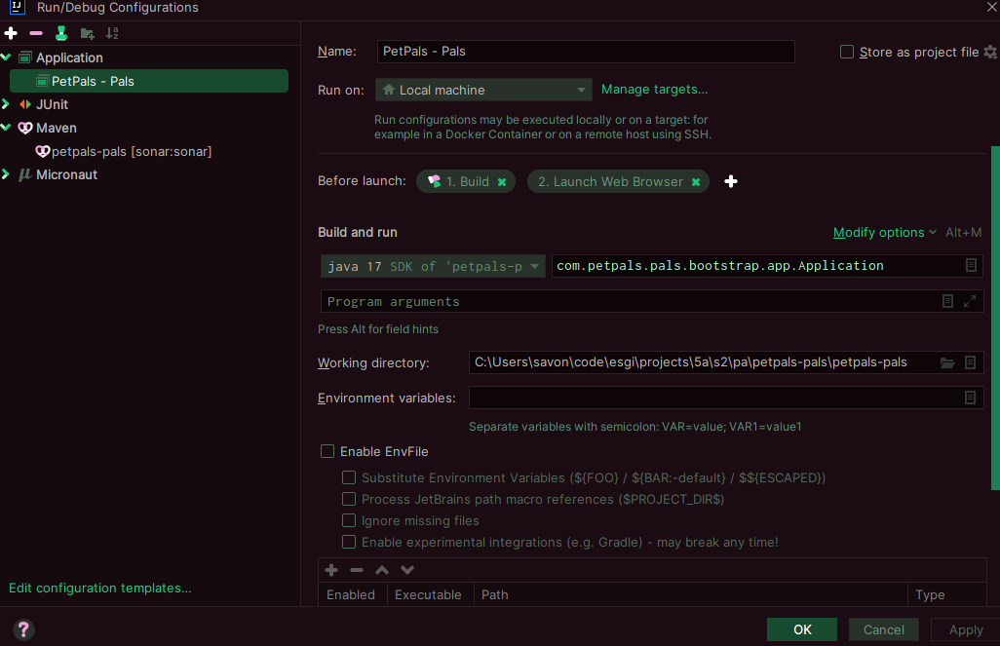

## <c>Prerequisites</c>
> - Java 17
> - Maven 3.9.6
> - Intellij Ultimate
> - local sonarqube server (not mandatory)

## <g>Launch App</g>

- run "mvn clean install"
- create application configuration 

## <b>Micronaut 4.3.6 Documentation</b>
- [User Guide](https://docs.micronaut.io/4.3.6/guide/index.html)
- [API Reference](https://docs.micronaut.io/4.3.6/api/index.html)
- [Configuration Reference](https://docs.micronaut.io/4.3.6/guide/configurationreference.html)
- [Micronaut Guides](https://guides.micronaut.io/index.html)

- [Micronaut Maven Plugin documentation](https://micronaut-projects.github.io/micronaut-maven-plugin/latest/)

## <b>Feature maven-enforcer-plugin documentation

- [https://maven.apache.org/enforcer/maven-enforcer-plugin/](https://maven.apache.org/enforcer/maven-enforcer-plugin/)

## Feature jax-rs documentation

- [Micronaut JAX-RS support documentation](https://micronaut-projects.github.io/micronaut-jaxrs/latest/guide/index.html)

## Feature junit-platform-suite-engine documentation

- [https://junit.org/junit5/docs/current/user-guide/#junit-platform-suite-engine-setup](https://junit.org/junit5/docs/current/user-guide/#junit-platform-suite-engine-setup)

## Feature undertow-server documentation

- [Micronaut Undertow Server documentation](https://micronaut-projects.github.io/micronaut-servlet/1.0.x/guide/index.html#undertow)

## Feature serialization-jackson documentation

- [Micronaut Serialization Jackson Core documentation](https://micronaut-projects.github.io/micronaut-serialization/latest/guide/)

## Feature http-client documentation

- [Micronaut HTTP Client documentation](https://docs.micronaut.io/latest/guide/index.html#nettyHttpClient)

## Feature validation documentation

- [Micronaut Validation documentation](https://micronaut-projects.github.io/micronaut-validation/latest/guide/)

## Feature micronaut-aot documentation

- [Micronaut AOT documentation](https://micronaut-projects.github.io/micronaut-aot/latest/guide/)
</b>

