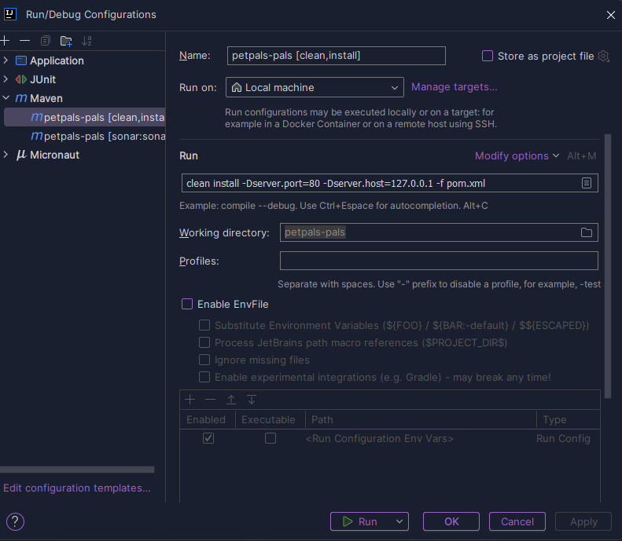
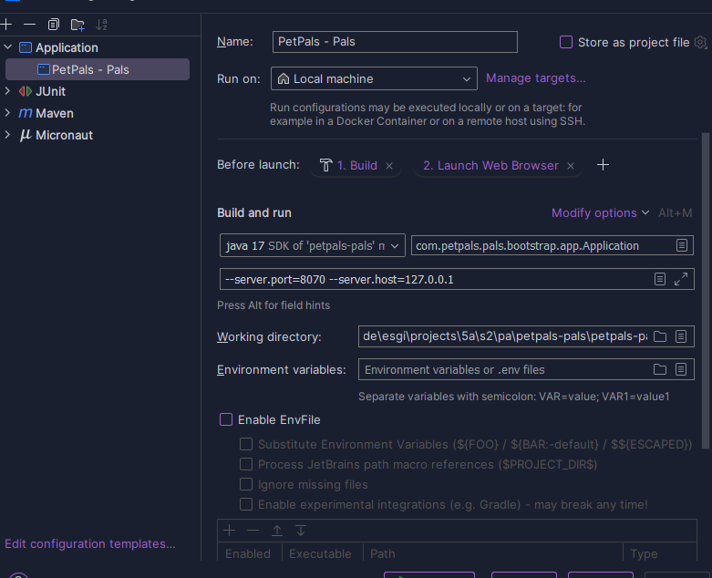

## <c>Prerequisites</c>
> - Java 17
> - Maven 3.9.6
> - Intellij Ultimate
> - local sonarqube server (not mandatory)

## <g>Launch App</g>

- run "mvn clean install -Dserver.port=80 -Dserver.host=127.0.0.1"

- create application configuration

## Intellij Run config

## <b>Micronaut 4.3.6 Documentation</b>
- [User Guide](https://docs.micronaut.io/4.3.6/guide/index.html)
- [API Reference](https://docs.micronaut.io/4.3.6/api/index.html)
- [Configuration Reference](https://docs.micronaut.io/4.3.6/guide/configurationreference.html)
- [Micronaut Guides](https://guides.micronaut.io/index.html)

- [Micronaut Maven Plugin documentation](https://micronaut-projects.github.io/micronaut-maven-plugin/latest/)

## <b>Feature maven-enforcer-plugin documentation

- [https://maven.apache.org/enforcer/maven-enforcer-plugin/](https://maven.apache.org/enforcer/maven-enforcer-plugin/)

## Feature jax-rs documentation

- [Micronaut JAX-RS support documentation](https://micronaut-projects.github.io/micronaut-jaxrs/latest/guide/index.html)

## Feature junit-platform-suite-engine documentation

- [https://junit.org/junit5/docs/current/user-guide/#junit-platform-suite-engine-setup](https://junit.org/junit5/docs/current/user-guide/#junit-platform-suite-engine-setup)

## Feature undertow-server documentation

- [Micronaut Undertow Server documentation](https://micronaut-projects.github.io/micronaut-servlet/1.0.x/guide/index.html#undertow)

## Feature serialization-jackson documentation

- [Micronaut Serialization Jackson Core documentation](https://micronaut-projects.github.io/micronaut-serialization/latest/guide/)

## Feature http-client documentation

- [Micronaut HTTP Client documentation](https://docs.micronaut.io/latest/guide/index.html#nettyHttpClient)

## Feature validation documentation

- [Micronaut Validation documentation](https://micronaut-projects.github.io/micronaut-validation/latest/guide/)

## Feature micronaut-aot documentation

- [Micronaut AOT documentation](https://micronaut-projects.github.io/micronaut-aot/latest/guide/)
</b>

Le programme :
Vous êtes séquestré par des geeks en maths et ils refusent de vous libérer tant que vous n'aurez pas résolu le problème. Vous devez sauvez votre peau en résolvant le problème.

Ils vous donnent deux entiers N et K. Vous devez trouver le plus petit et le plus grand entier positif qu'il est possible de construire avec N chiffres avant exactement K chiffres différents entre 0 et 9.

Par exemple: 99987 possède 3 chiffres distincts 9, 8 and 7.

Évidemment, les 0 en début ne sont pas autorisés. Par exemple, 0145 n'est pas autorisé. L'entrée donnée possède toujours une réponse correcte.

ENTRÉE :
Ligne 1 : Le nombre de chiffres N et le nombre de chiffres distincts K

SORTIE :
Ligne 1: Le plus petit et le plus grand nombre, séparés par un espace.

CONTRAINTES :
1 ≤ N ≤ 18
1 ≤ K ≤ 10

EXEMPLE :
Entrée
3 3
Sortie
102 987
 
